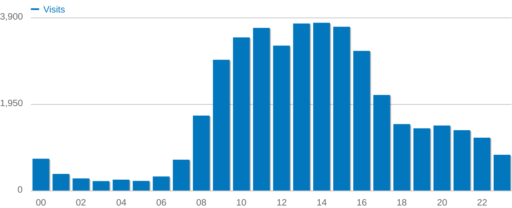
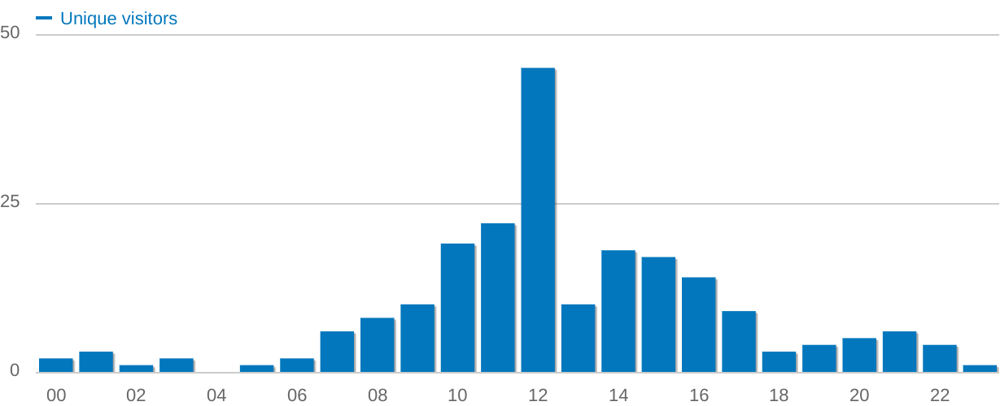

Stress tests for the map
========================

The goal of the stress tests is to gain insight into how the system behaves when stressed with that map display. 
For this we have to compare the map usage on the site with 'normal' usage without the map. 

## Site usage (production)

To understand the expected usage on the Archaeology Datastations, we analyzed the 'Matomo' usage statistics. We focused on the yearly average for 2024 and some recent high-load events. Screenshots of these statistics are displayed below.

The 'working hours' plateau (on avarage) is around 25 users per hour. 

The peak here is at 45 users per hour.

Although this is some indication, we do not know how much 'actions' are done by these users and also not how these are distributed within that hour. 

## Server configurations

Testing with different servers can show how different configurations can translate to different behavior. 
Note that each server should have Dataverse with at least 100 published datasets that have coordinates. Otherwise test results would be difficult to compare. For testing, these datasets can be created using a Python script from the 'dataverse-dataset-geomap-view' Github project: https://github.com/DANS-KNAW/dataverse-dataset-geomap-view/tree/main/examples .

### dev
- Virtualbox on a Framework laptop
- DV version: v. 6.3 build DANS-DataStation-PATCH-9
- RAM: 64G
- CPU: 12th Gen Intel(R) Core(TM) i7-1280P
- Payara heapsize: 2G
- Solr heapsize: 1G

### test
- RedHat VM from the KNAW
- DV version: v. 6.5 build v6.5-DANS-DataStation-BULK-DELETE-UPDATE
- RAM: 14G
- CPU: Intel(R) Xeon(R) Gold 6138 CPU @ 2.00GHz 
- Payara heapsize: 8G
- Solr heapsize: 1G

### demo
- RedHat VM from the KNAW, most similar to production
- DV version: v. 6.3 build DANS-DataStation-PATCH-10
- RAM: 8G
- CPU: Intel(R) Xeon(R) Gold 6138 CPU @ 2.00GHz 
- Payara heapsize: 2G
- Solr heapsize: 1G

## JMeter test setup

The JMeter test file from the 'dataverse-dataset-geomap-view' Github project was used and adapted for these tests. 
- Simulate the following number of simultaneous users; 10, 25 and 50
- Use ramp-up time of 10 seconds, sort of 'warming up' the system gradually. 
- For the 'non-map' usage each user requests for the homepage. 
- To simulate the map display load the user is also doing a search API request after the homepage request. For that API it is requesting a 100 results at maximum. The API allows this to be up to a 1000, however this was found be be problematic; takes about ten times longer. 

Watching the 'graph' and stopped the test when a stable level was reached. 

## Test results

Tables with average seconds per request after the service has reached a stable level. 

### dev

| #users | homepage only | map (homepage part)|  map part     |
|:-------|--------------:|-------------------:|--------------:|
| 10     |           0.33|                0.65|           1.62|
| 25     |           0.60|                2.10|           2.96|
| 50     |           1.16|                4.57|           5.60|

### test

| #users | homepage only | map (homepage part)|  map part     |
|:-------|--------------:|-------------------:|--------------:|
| 10     |           0.44|                0.42|           5.35|
| 25     |           1.06|                0.76|          13.04|
| 50     |           2.15|                1.46|          25.44|

### demo

| #users | homepage only | map (homepage part)|  map part     |
|:-------|--------------:|-------------------:|--------------:|
| 10     |           0.68|                1.02|           2.48|
| 25     |           1.06|                3.70|           5.20|
| 50     |           2.10|                7.70|           9.40|

Results for the average duration are almost linear with the number of users.
Comparing test and demo; 'homepage only' is similar, but map related is more than twice as long on test.  
On the other hand, the homepage part is much faster on the test server. 
Also, on that test server the homepage stays fast under stress, while the map takes much longer. 
Unfortunately I can not explain the differences in the results for the servers from the configuration differences. 

### Some notes on testing

There is some difficulty with interpreting these numbers; what does it mean for a user on the site when it is under stress. Therefore I also used the site while testing, trying not to influence the testing itself. 

## Conclusions

Although the system struggled, it never went down completely. After encountering an error, it managed to recover. The Search API now utilizes the database, which might explain why its performance appears somewhat independent of the simpler homepage load (which relies solely on Solr). It seems probable that errors stem from the database being unable to handle the volume of requests.

Under stress, performance degrades because our systems cannot scale up effectively. The key question is: what level of performance loss is acceptable? Actions involving the database are likely less frequent (e.g., editing or creating a dataset) and often have progress indicators on the web page. These can take a bit longer before users get frustrated. However, standard navigation (via buttons and links without progress indicators) or page reloads should not take too long; more than a few seconds can be annoying, and ideally, it should be within a second.

With this in mind, the results on the demo server with 10 simultaneous users are acceptable. With 25 users, things are not as good; almost four seconds (on average) for the home page to load is too long. However, we need to realize that having 25 users all simultaneously reloading or pushing the 'More...' button repeatedly is not a realistic usage pattern.

The expectation is that in production, the system works under 'normal' conditions, where it could be a bit slow under high load but not unacceptable.

## Suggestions for improvements of future tests
JMeter tests do not reflect realistic usage patterns. We need to incorporate timers to simulate real-world usage more accurately. Additionally, we have not monitored server metrics and not investigated errors during the tests, which is important for a comprehensive analysis.

